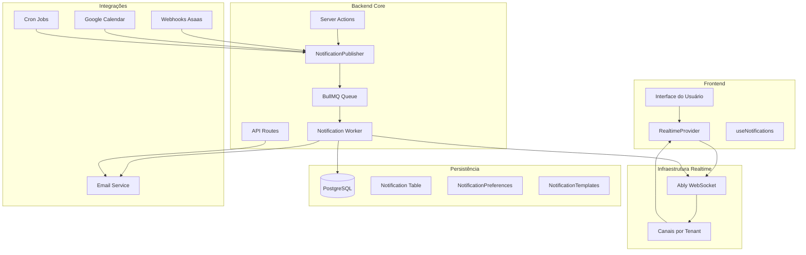

# 🏗️ Arquitetura Técnica - Sistema de Notificações Push

**Data de Criação:** 25/01/2025  
**Status:** ⏳ **Em Desenvolvimento** - Etapa 2

---

## 🎯 **DECISÕES ARQUITETURAIS**

### **Stack Realtime Escolhido: Ably** ✅

**Motivos:**
- ✅ **Já implementado** no sistema atual
- ✅ **Escalabilidade** automática
- ✅ **Confiabilidade** com fallbacks
- ✅ **WebSocket** nativo com reconexão automática
- ✅ **Multi-tenant** suportado
- ✅ **Rate limiting** built-in

**Configuração Atual:**
```typescript
// Backend
ABLY_API_KEY=xxx
REALTIME_CHANNEL_PREFIX=ml-dev

// Frontend  
NEXT_PUBLIC_ABLY_CLIENT_KEY=xxx
NEXT_PUBLIC_REALTIME_CHANNEL_PREFIX=ml-dev
```

---

## 🏗️ **TOPOLOGIA DO SISTEMA**



---

## 📊 **ESTRUTURA DE DADOS**

### **Tabela: Notification**
```sql
CREATE TABLE Notification (
  id UUID PRIMARY KEY DEFAULT gen_random_uuid(),
  tenantId UUID NOT NULL REFERENCES Tenant(id) ON DELETE CASCADE,
  userId UUID NOT NULL REFERENCES Usuario(id) ON DELETE CASCADE,
  type VARCHAR(100) NOT NULL, -- 'processo.created', 'prazo.expiring_7d', etc.
  title VARCHAR(255) NOT NULL,
  message TEXT NOT NULL,
  payload JSONB, -- Dados específicos do evento
  urgency NotificationUrgency NOT NULL DEFAULT 'MEDIUM',
  channels NotificationChannel[] NOT NULL DEFAULT ['REALTIME'],
  readAt TIMESTAMP,
  createdAt TIMESTAMP DEFAULT NOW(),
  expiresAt TIMESTAMP,
  
  -- Índices para performance
  INDEX idx_notification_tenant_user (tenantId, userId),
  INDEX idx_notification_tenant_type (tenantId, type),
  INDEX idx_notification_tenant_urgency (tenantId, urgency),
  INDEX idx_notification_created (createdAt),
  INDEX idx_notification_expires (expiresAt)
);
```

### **Tabela: NotificationPreferences**
```sql
CREATE TABLE NotificationPreferences (
  id UUID PRIMARY KEY DEFAULT gen_random_uuid(),
  tenantId UUID NOT NULL REFERENCES Tenant(id) ON DELETE CASCADE,
  userId UUID NOT NULL REFERENCES Usuario(id) ON DELETE CASCADE,
  eventType VARCHAR(100) NOT NULL, -- 'processo.created', 'prazo.expiring_7d'
  enabled BOOLEAN DEFAULT TRUE,
  channels NotificationChannel[] DEFAULT ['REALTIME'],
  urgency NotificationUrgency DEFAULT 'MEDIUM',
  createdAt TIMESTAMP DEFAULT NOW(),
  updatedAt TIMESTAMP DEFAULT NOW(),
  
  -- Constraint único por tenant/user/evento
  UNIQUE(tenantId, userId, eventType),
  
  -- Índices para performance
  INDEX idx_preferences_tenant_user (tenantId, userId),
  INDEX idx_preferences_tenant_event (tenantId, eventType)
);
```

### **Tabela: NotificationTemplate**
```sql
CREATE TABLE NotificationTemplate (
  id UUID PRIMARY KEY DEFAULT gen_random_uuid(),
  tenantId UUID NOT NULL REFERENCES Tenant(id) ON DELETE CASCADE,
  eventType VARCHAR(100) NOT NULL,
  title VARCHAR(255) NOT NULL,
  message TEXT NOT NULL,
  variables JSONB, -- Variáveis disponíveis para substituição
  isDefault BOOLEAN DEFAULT FALSE,
  createdAt TIMESTAMP DEFAULT NOW(),
  updatedAt TIMESTAMP DEFAULT NOW(),
  
  -- Constraint único por tenant/evento
  UNIQUE(tenantId, eventType),
  
  -- Índices para performance
  INDEX idx_template_tenant_event (tenantId, eventType),
  INDEX idx_template_default (isDefault)
);
```

---

## 🔄 **FLUXO DE EVENTOS**

### **1. Geração de Evento**
```typescript
// Em qualquer Server Action
await publishNotification({
  type: 'processo.created',
  tenantId: 'tenant-123',
  userId: 'user-456',
  payload: {
    processoId: 'proc-789',
    numero: '1234567-89.2024.8.05.0001',
    cliente: 'João Silva'
  },
  urgency: 'medium'
});
```

### **2. Processamento**
```typescript
// NotificationPublisher
1. Validar permissões do usuário
2. Aplicar preferências de notificação
3. Verificar deduplicação (hash + TTL)
4. Gerar template personalizado
5. Salvar no banco de dados
6. Enviar via Ably (tempo real)
7. Enviar via email (se configurado)
```

### **3. Deduplicação/Anti-Spam**
```typescript
// Sistema de deduplicação
const eventHash = crypto.createHash('sha256')
  .update(`${eventType}:${tenantId}:${userId}:${JSON.stringify(payload)}`)
  .digest('hex');

// Verificar se evento já foi processado nos últimos 5 minutos
const existingNotification = await prisma.notification.findFirst({
  where: {
    tenantId,
    userId,
    type: eventType,
    createdAt: {
      gte: new Date(Date.now() - 5 * 60 * 1000) // 5 minutos
    }
  }
});

if (existingNotification) {
  return; // Evento duplicado, não processar
}
```

### **4. Entrega**
```typescript
// Frontend
1. Receber evento via Ably
2. Atualizar estado local
3. Mostrar toast/notificação
4. Atualizar contador de não lidos
5. Salvar como lida (opcional)
```

---

## 🚀 **ESCALABILIDADE**

### **Sharding por Tenant**
- Cada tenant tem seu próprio canal Ably
- Canais: `ml-dev:tenant:{tenantId}`
- Isolamento completo entre tenants

### **Tolerância a Falhas**
- Fallback HTTP se Ably falhar
- Retry automático com backoff
- Dead letter queue para eventos perdidos

### **Política de Reconexão**
- Reconexão automática em 5s
- Reenvio de eventos pendentes
- Heartbeat a cada 30s

---

## 📱 **CANAIS DE NOTIFICAÇÃO**

### **Tempo Real (WebSocket)**
```typescript
// Via Ably
{
  type: 'notification.new',
  data: {
    id: 'notif-123',
    title: 'Novo processo criado',
    message: 'Processo 1234567-89 foi criado',
    urgency: 'medium',
    payload: { processoId: 'proc-789' }
  }
}
```

### **Email**
```typescript
// Via Email Service
{
  to: 'user@example.com',
  subject: 'Magic Lawyer - Novo processo criado',
  template: 'processo-created',
  data: { processoId: 'proc-789', numero: '1234567-89' }
}
```

### **Push Mobile** (Futuro)
```typescript
// Via Firebase/APNs
{
  title: 'Novo processo criado',
  body: 'Processo 1234567-89 foi criado',
  data: { processoId: 'proc-789' }
}
```

---

## 🔧 **CONFIGURAÇÕES DE AMBIENTE**

### **Variáveis Necessárias**
```bash
# Ably (já configurado)
ABLY_API_KEY=xxx
NEXT_PUBLIC_ABLY_CLIENT_KEY=xxx
REALTIME_CHANNEL_PREFIX=ml-dev
NEXT_PUBLIC_REALTIME_CHANNEL_PREFIX=ml-dev

# Notificações (novas)
NOTIFICATION_RETENTION_DAYS=30
NOTIFICATION_BATCH_SIZE=100
NOTIFICATION_RATE_LIMIT=1000
NOTIFICATION_DEDUP_TTL_MINUTES=5

# Email (já configurado)
EMAIL_FROM=noreply@magiclawyer.com
SMTP_HOST=smtp.resend.com
SMTP_PORT=587
SMTP_USER=resend
SMTP_PASS=xxx

# Redis (para BullMQ)
REDIS_URL=redis://localhost:6379
REDIS_PASSWORD=xxx

# Rate Limiting
NOTIFICATION_RATE_LIMIT_PER_USER=100
NOTIFICATION_RATE_LIMIT_PER_TENANT=1000
```

### **Quadro de Configurações por Ambiente**
| Ambiente | Redis | Ably | Rate Limit | Observações |
|----------|-------|------|------------|-------------|
| **Development** | Local | Sandbox | 1000/h | Para testes |
| **Staging** | Cloud | Production | 5000/h | Pré-produção |
| **Production** | Cloud | Production | 10000/h | Produção |

---

## 🛡️ **SEGURANÇA E COMPLIANCE**

### **LGPD**
- Opt-in/opt-out por usuário
- Retenção de dados por 30 dias
- Logs de consentimento
- Exportação de dados

### **Isolamento Multi-tenant**
- Canais separados por tenant
- Validação de permissões
- Dados isolados no banco

### **Rate Limiting**
- **Middleware Next.js**: 100 notificações/minuto por usuário
- **Ably Built-in**: 1000 notificações/hora por tenant
- **NotificationService**: Backoff automático quando limites são atingidos
- **Configuração**: `NOTIFICATION_RATE_LIMIT_PER_USER` e `NOTIFICATION_RATE_LIMIT_PER_TENANT`

---

## 📈 **MÉTRICAS E MONITORAMENTO**

### **KPIs**
- Taxa de entrega (target: >99%)
- Tempo médio de entrega (target: <1s)
- Taxa de leitura (target: >80%)
- Satisfação do usuário

### **Alertas**
- Falha na entrega >5%
- Latência >5s
- Erro de conexão Ably
- Quota excedida

---

## 🔄 **MIGRAÇÃO DE DADOS**

### **Seeds Iniciais**
```typescript
// Preferências padrão por role
const defaultPreferences = {
  SUPER_ADMIN: ['processo.*', 'cliente.*', 'financeiro.*', 'equipe.*'],
  ADMIN: ['processo.*', 'cliente.*', 'financeiro.*', 'equipe.*'],
  ADVOGADO: ['processo.*', 'cliente.*', 'agenda.*', 'prazo.*'],
  SECRETARIA: ['processo.*', 'cliente.*', 'agenda.*', 'prazo.*'],
  FINANCEIRO: ['financeiro.*', 'contrato.*', 'pagamento.*'],
  CLIENTE: ['processo.*', 'contrato.*', 'pagamento.*']
};
```

### **Estratégia de Expansão de Curingas**
```typescript
// O Prisma não suporta curingas nativamente
// Solução: Expandir curingas para eventos específicos no seed

const expandWildcards = (wildcardPattern: string): string[] => {
  const eventMap = {
    'processo.*': ['processo.created', 'processo.updated', 'processo.status_changed'],
    'cliente.*': ['cliente.created', 'cliente.updated', 'cliente.document_uploaded'],
    'financeiro.*': ['pagamento.paid', 'pagamento.failed', 'boleto.generated'],
    'equipe.*': ['equipe.user_invited', 'equipe.user_joined', 'equipe.permissions_changed']
  };
  
  return eventMap[wildcardPattern] || [wildcardPattern];
};

// No seed, expandir curingas para eventos específicos
for (const [role, patterns] of Object.entries(defaultPreferences)) {
  for (const pattern of patterns) {
    const specificEvents = expandWildcards(pattern);
    for (const eventType of specificEvents) {
      await createPreference(tenantId, userId, eventType, config);
    }
  }
}
```

### **Templates Padrão**
```typescript
// Templates para cada tipo de evento
const defaultTemplates = {
  'processo.created': {
    title: 'Novo processo criado',
    message: 'Processo {numero} foi criado para {cliente}'
  },
  'prazo.expiring_7d': {
    title: 'Prazo próximo do vencimento',
    message: 'Prazo do processo {numero} vence em 7 dias'
  }
};
```

---

## ✅ **PRÓXIMOS PASSOS**

1. ✅ **Arquitetura Definida** - Este documento
2. ⏳ **Implementar Schema** - Criar tabelas no Prisma
3. ⏳ **NotificationPublisher** - Serviço core de notificações
4. ⏳ **Templates System** - Sistema de templates
5. ⏳ **Preferências** - Sistema de preferências por usuário

---

**Status:** ⏳ **Em Desenvolvimento** - Etapa 2
