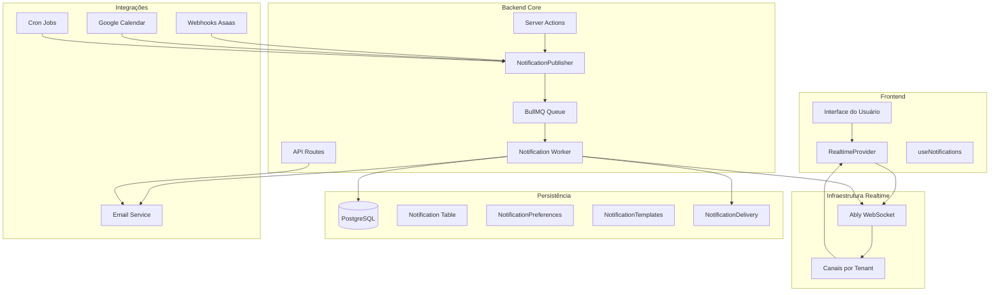

# 🏗️ Arquitetura Técnica - Sistema de Notificações Push

**Data de Criação:** 25/01/2025  
**Status:** ⏳ **Em Desenvolvimento** - Backend com fila e rastreio de entrega (Realtime + Email)

---

## 🎯 **DECISÕES ARQUITETURAIS**

### **Stack Realtime Escolhido: Ably** ✅

**Motivos:**
- ✅ **Já implementado** no sistema atual
- ✅ **Escalabilidade** automática
- ✅ **Confiabilidade** com fallbacks
- ✅ **WebSocket** nativo com reconexão automática
- ✅ **Multi-tenant** suportado
- ✅ **Rate limiting** built-in

**Configuração Atual:**
```typescript
// Backend
ABLY_API_KEY=xxx
REALTIME_CHANNEL_PREFIX=ml-dev

// Frontend  
NEXT_PUBLIC_ABLY_CLIENT_KEY=xxx
NEXT_PUBLIC_REALTIME_CHANNEL_PREFIX=ml-dev
```

---

## 🏗️ **TOPOLOGIA DO SISTEMA**



---

## 📊 **ESTRUTURA DE DADOS**

### **Tabela: Notification**
```sql
CREATE TABLE Notification (
  id UUID PRIMARY KEY DEFAULT gen_random_uuid(),
  tenantId UUID NOT NULL REFERENCES Tenant(id) ON DELETE CASCADE,
  userId UUID NOT NULL REFERENCES Usuario(id) ON DELETE CASCADE,
  type VARCHAR(100) NOT NULL, -- 'processo.created', 'prazo.expiring_7d', etc.
  title VARCHAR(255) NOT NULL,
  message TEXT NOT NULL,
  payload JSONB, -- Dados específicos do evento
  urgency NotificationUrgency NOT NULL DEFAULT 'MEDIUM',
  channels NotificationChannel[] NOT NULL DEFAULT ['REALTIME'],
  readAt TIMESTAMP,
  createdAt TIMESTAMP DEFAULT NOW(),
  expiresAt TIMESTAMP,
  
  -- Índices para performance
  INDEX idx_notification_tenant_user (tenantId, userId),
  INDEX idx_notification_tenant_type (tenantId, type),
  INDEX idx_notification_tenant_urgency (tenantId, urgency),
  INDEX idx_notification_created (createdAt),
  INDEX idx_notification_expires (expiresAt)
);
```

### **Tabela: NotificationPreferences**
```sql
CREATE TABLE NotificationPreferences (
  id UUID PRIMARY KEY DEFAULT gen_random_uuid(),
  tenantId UUID NOT NULL REFERENCES Tenant(id) ON DELETE CASCADE,
  userId UUID NOT NULL REFERENCES Usuario(id) ON DELETE CASCADE,
  eventType VARCHAR(100) NOT NULL, -- 'processo.created', 'prazo.expiring_7d'
  enabled BOOLEAN DEFAULT TRUE,
  channels NotificationChannel[] DEFAULT ['REALTIME'],
  urgency NotificationUrgency DEFAULT 'MEDIUM',
  createdAt TIMESTAMP DEFAULT NOW(),
  updatedAt TIMESTAMP DEFAULT NOW(),
  
  -- Constraint único por tenant/user/evento
  UNIQUE(tenantId, userId, eventType),
  
  -- Índices para performance
  INDEX idx_preferences_tenant_user (tenantId, userId),
  INDEX idx_preferences_tenant_event (tenantId, eventType)
);
```

### **Tabela: NotificationDelivery**
```sql
CREATE TABLE NotificationDelivery (
  id UUID PRIMARY KEY DEFAULT gen_random_uuid(),
  notificationId UUID NOT NULL REFERENCES Notification(id) ON DELETE CASCADE,
  channel NotificationChannel NOT NULL,
  provider VARCHAR(50) NOT NULL, -- ABLY, RESEND, etc.
  providerMessageId VARCHAR(255),
  status NotificationDeliveryStatus DEFAULT 'PENDING',
  errorCode VARCHAR(50),
  errorMessage VARCHAR(500),
  metadata JSONB,
  createdAt TIMESTAMP DEFAULT NOW(),
  updatedAt TIMESTAMP DEFAULT NOW()
);
```

> **NotificationDeliveryStatus:** `PENDING`, `SENT`, `DELIVERED`, `READ`, `FAILED`

### **Tabela: NotificationTemplate**
```sql
CREATE TABLE NotificationTemplate (
  id UUID PRIMARY KEY DEFAULT gen_random_uuid(),
  tenantId UUID NOT NULL REFERENCES Tenant(id) ON DELETE CASCADE,
  eventType VARCHAR(100) NOT NULL,
  title VARCHAR(255) NOT NULL,
  message TEXT NOT NULL,
  variables JSONB, -- Variáveis disponíveis para substituição
  isDefault BOOLEAN DEFAULT FALSE,
  createdAt TIMESTAMP DEFAULT NOW(),
  updatedAt TIMESTAMP DEFAULT NOW(),
  
  -- Constraint único por tenant/evento
  UNIQUE(tenantId, eventType),
  
  -- Índices para performance
  INDEX idx_template_tenant_event (tenantId, eventType),
  INDEX idx_template_default (isDefault)
);
```

---

## 🔄 **FLUXO DE EVENTOS**

### **1. Geração de Evento**
```typescript
// Em qualquer Server Action
await publishNotification({
  type: 'processo.created',
  tenantId: 'tenant-123',
  userId: 'user-456',
  payload: {
    processoId: 'proc-789',
    numero: '1234567-89.2024.8.05.0001',
    cliente: 'João Silva'
  },
  urgency: 'medium'
});
```

### **2. Processamento**
```typescript
// NotificationPublisher
1. Validar permissões do usuário
2. Aplicar preferências de notificação
3. Verificar deduplicação (hash + TTL)
4. Gerar template personalizado
5. Salvar no banco de dados (Notification)
6. Registrar deliveries por canal (NotificationDelivery - status PENDING)
7. Enviar via canais configurados (Ably e Email per-tenant via Nodemailer)
8. Atualizar status do delivery -> SENT/FAILED com messageId do provedor
```

### **3. Deduplicação/Anti-Spam**
```typescript
// Sistema de deduplicação
const eventHash = crypto.createHash('sha256')
  .update(`${eventType}:${tenantId}:${userId}:${JSON.stringify(payload)}`)
  .digest('hex');

// Verificar se evento já foi processado nos últimos 5 minutos
const existingNotification = await prisma.notification.findFirst({
  where: {
    tenantId,
    userId,
    type: eventType,
    createdAt: {
      gte: new Date(Date.now() - 5 * 60 * 1000) // 5 minutos
    }
  }
});

if (existingNotification) {
  return; // Evento duplicado, não processar
}
```

### **4. Entrega**
```typescript
// Frontend
1. Receber evento via Ably
2. Atualizar estado local
3. Mostrar toast/notificação
4. Atualizar contador de não lidos
5. Salvar como lida (opcional)
```

## 🚀 **ESCALABILIDADE**

### **Sharding por Tenant**
- Cada tenant tem seu próprio canal Ably
- Canais: `ml-dev:tenant:{tenantId}`
- Isolamento completo entre tenants

### **Tolerância a Falhas**
- Fallback HTTP se Ably falhar
- Retry automático com backoff
- Dead letter queue para eventos perdidos

### **Política de Reconexão**
- Reconexão automática em 5s
- Reenvio de eventos pendentes
- Heartbeat a cada 30s

---

## 📱 **CANAIS DE NOTIFICAÇÃO**

### **Tempo Real (WebSocket)**
```typescript
// Via Ably
{
  type: 'notification.new',
  data: {
    id: 'notif-123',
    title: 'Novo processo criado',
    message: 'Processo 1234567-89 foi criado',
    urgency: 'medium',
    payload: { processoId: 'proc-789' }
  }
}
```

### **Email**
```typescript
// Via Email Service
{
  to: 'user@example.com',
  subject: 'Magic Lawyer - Novo processo criado',
  template: 'processo-created',
  data: { processoId: 'proc-789', numero: '1234567-89' }
}
```

## 🔧 **CONFIGURAÇÕES DE AMBIENTE**

### **Variáveis de Ambiente Necessárias**
```bash
# Realtime
ABLY_API_KEY=...
NEXT_PUBLIC_ABLY_CLIENT_KEY=...
REALTIME_CHANNEL_PREFIX=ml-dev
NEXT_PUBLIC_REALTIME_CHANNEL_PREFIX=ml-dev
REALTIME_INTERNAL_TOKEN=...

# Toggle do sistema novo
NOTIFICATION_USE_NEW_SYSTEM=true

# Redis (deduplicação e fila)
REDIS_URL=rediss://...

# Email (credenciais globais opcionais; preferencialmente por tenant)
SMTP_HOST=smtp.gmail.com
SMTP_PORT=465
SMTP_SECURE=true
SMTP_USER=...
SMTP_PASS=...

# Crons e integrações externas
CRON_SECRET=...
ASAAS_API_KEY=...
ASAAS_WEBHOOK_SECRET=...
```


---

## ⚠️ **STATUS REAL DO SISTEMA**

### **✅ Implementado:**
1. ✅ **Schema Prisma** - Notification, NotificationPreference, NotificationTemplate + NotificationDelivery
2. ✅ **BullMQ + Redis** - Infraestrutura de fila configurada
3. ✅ **NotificationService** - Serviço base + registro de deliveries, deduplicação e canal dinâmico
4. ✅ **Worker Assíncrono** - Worker BullMQ operacional
5. ✅ **Camada de Domínio** - `NotificationFactory` e `NotificationPolicy` aplicando regras de negócio
6. ✅ **Canais Reais** - Ably (in-app) e Email (Nodemailer por tenant)
7. ✅ **Crons Oficiais** - Prazos (`/api/cron/check-deadlines`) e contratos (`/api/cron/check-contracts`) agendados na Vercel
8. ✅ **Webhook Asaas** - Eventos mapeados: criação, pagamento, falha, atraso e estorno
9. ✅ **Página de Preferências** - `/usuario/preferencias-notificacoes` com seleção de canais

### **⚠️/❌ Pontos de Atenção:**
1. ⚠️ **Fallback HTTP/Polling** - Invalidação via API implementada; polling a cada 30s para clientes offline ainda pendente
2. ⚠️ **Rollout** - Sistema híbrido ativo; é necessário plano de migração completa dos consumidores legados
3. ⚠️ **Auditoria de Preferências** - Falta log dedicado de consentimento LGPD e presets por role
4. ❌ **Documentos & Equipe** - Eventos ainda não disparados para esses módulos
5. ❌ **Métricas/Observabilidade** - Dashboards e alertas de entrega não configurados

### **🔧 Próximos Passos Críticos:**
1. **Finalizar integração dos módulos pendentes** - Documentos, Equipe e lembretes adicionais de Agenda
2. **Implementar fallback HTTP completo** - Polling tolerante a falhas para ambientes sem WebSocket
3. **Concluir rollout híbrido** - Migrar leitores legados para `NotificationDelivery`
4. **Adicionar auditoria de preferências** - Consentimento LGPD, presets por role e exportação por tenant
5. **Instrumentar métricas** - Dashboards, alertas e testes de carga para fila/worker

---

**Status:** ✅ **Backend consolidado no novo sistema de notificações** — rollout completo ainda em andamento
